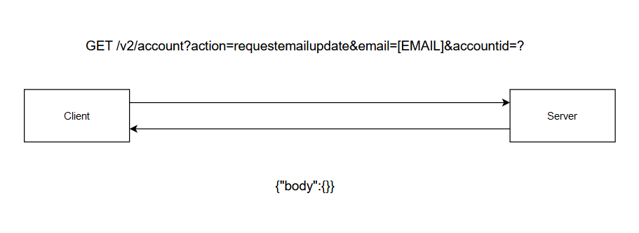
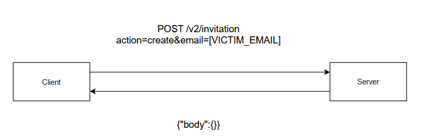
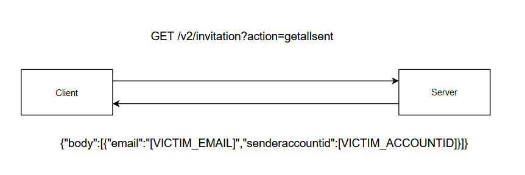
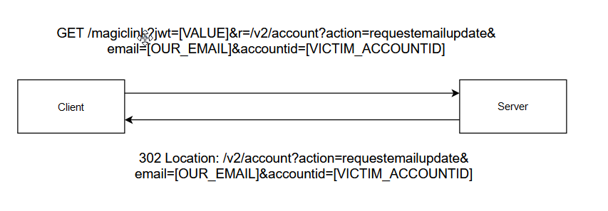

# Account Take Over Through A CSRF Combined With An Invitation Feature & The Login Functionality.

## How

While testing the api I thought about downloading the apk version of this app to see if there are another endpoints that I can test it further. After decompiling the apk I
noticed an endpoint that changes the email of the user and I noticed that this endpoint is open to ***CSRF*** vulnerability, but The 
endpoint needed an additional information for the attack to be successful and I was able to get it using the invitation feature. After this I used the login functionality to deliver the attack with a better way and eleminate the factor of complexity.

# The CSRF Vulnerability

- After decompiling the apk I have an endpoint like this ***/v2/account***.
- This endpoint expected to be sent as a ***POST*** request with a this body:
  ***action=requestemailupdate&email=&accountid=*** 
- So I tried to send this request as a ***GET*** request and it was successful. All I needed is to provide the accountid of the user doing this action and a new email.
- So I wanted to first identify if I can craft a simple form with a ***GET*** request to validate the CSRF vulnerability and it was successful.
- This attack worked because The cookie was protected with just the ***LAX*** samesite flag and I was able to send it as a ***GET***
  request and the application didn't really check on anything else.
- But as you can see if want to target a specific user how I need to know his accountid.
- So how I am going to get his accountid?

  

# The Invitation Feature

- The application had an invitation feature to invite other user to compete on different things.
- I was able to know this from the apk also because I was able to find an invitation endpoint ***/v2/invitation***
- This endpoint expected to be sent as a POST request with this body:
  action=getallrecieved.
- From the name of the action I anticipated that it gets the invitations sent to me.
- So I thought can I send invitations? lets try another action what about ***send*** but the application responded with ***not implemented***.
- What about ***create***. The application responded that it needs a parameter called ***email***.
- Suppling the email The request was successful and I recieved the invitation. But the response was an empty body.
- But if I can there is an action called ***getallrecieved*** maybe there is an action called ***getallsent***.
- And yes with this action I recieved a response with all the invitations I sent with the email and the ***accountid*** of the user.
- With this the ***CSRF*** attack was ready to be delivered. But can I find a better way to deliever this attack?

  

  

# The Login Functionality

- The application gives you the option to login by providing your email then recieving a magic link to click and sign you in.
- This endpoint expects to recieve a parameter called ***r*** to be sent as a body or as query.
- This parameter is a redirection parameter that redirects the user to an endpoint he wants after logging.
- The application appends the parameter to the magic link so as soon as you click it the application sign you in then redirects to the value of ***r***.
- So it's a feature really no open redirect here but we can use it to make the user be redirected to the csrf endpoint and change his email to our email.
- All I have to do is to put the ***CSRF*** payload as value to the ***r*** parameter like this:
  ***r=/v2/account?action=requestemailupdate&email=[OUR_EMAIL]&accountid=[THE_VICTIM_ACCOUNTID]***.
- Sending this with the login request the applicaiton is going to append it to the magic link and as soon as the user click it the application is going to sign him in
  then is going to redirect him to the ***CSRF*** endpoint to change his email and with the we were able to takeover the user account.
  
  
  
## My Info
  
#### Yeswehack  : <a href="https://yeswehack.com/hunters/mekky">https://yeswehack.com/user/mekky</a>

#### Intigriti  : <a href="https://app.intigriti.com/researcher/profile/mekky">https://app.intigriti.com/researcher/profile/mekky</a>

#### Linkedin   : <a href="https://www.linkedin.com/in/muhammed-mekkawy-1504821b2/">https://www.linkedin.com/in/muhammed-mekkawy-1504821b2/</a>

#### Twitter    : <a href="https://twitter.com/Mekky49295157">https://twitter.com/Mekky49295157</a>

