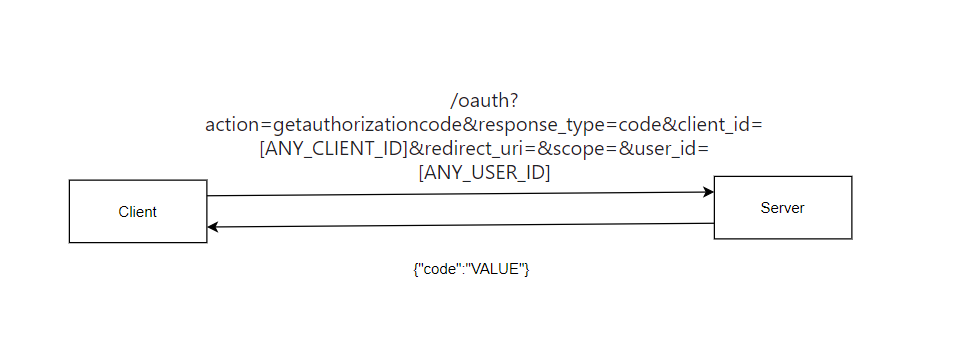
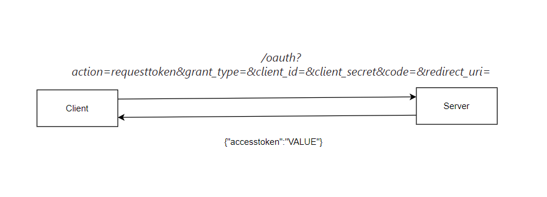

# Generate Oauth Code For Any User Within Any Partner

## How

The application has an Oauth functionality in order for partners to interact with its API and get other users resources after their consent. After looking at
the API documentation I noticed that when the partners try to get the user's OAuth code it deals with another subdomain and endpoint that is different than the
API subdomain and naming convention. So, this gave me an idea of can the partner do the same with the API.

## How the API works

I like to look at the API as an object that has different actions or methods that can be triggered on it. Like if you have an endpoint like this ***/account***
this endpoint is like an object that you can manipulate its properties with different actions like ***CREATE***, ***UPDATE***, ***DELETE***
or others it depends on the API itself some of them are using the request verbs and others have another implementation, but we have to try.

- Our application deals with the api like this ***/endpoint?action=***.
- The action here is what you want to do on this endpoint or object.
- The action had several naming notations depending on the object like ***get***, ***update***, ***getcode*** and others.
- From this naming notation you can anticipate or guess other actions that can be done on the single object.
- Another thing to look at when dealing with the API you have to know how it deals with a good request like sending a request with the right data, and how it deals while requesting an endpoint that doesn't exist or invalid data.
- Our application returns ***not implemented*** if I tried to request an endpoint or action that doesn't exist.
- If the action exists sometimes it tries to return the data or tell if there are other parameters needed for the request or it returns ***invalid parameters***.

## How the API OAuth endpoint looked like

- The api subdomain ***api.example.com***.
- The application API was clear that if I want to get the OAuth code I need to connect with another subdomain ***account.example.com*** and send a request like this ***account.example.com/?request_type=code&client_code=&redirect_uri=&scope=***.
- But at the same time the application documented that if I want to get the access token I have to communicate with the other subdomain like this ***api.example.com/oauth?action=requesttoken&grant_type=&client_id=&client_secret&code=&redirect_uri=***.
- So, I thought can I request the OAuth code like requesting the access_token from the API?
- Returning to the naming notation of the API if I have an action like ***/endpoint?action=get***, ***/oauth?action=requesttoken*** and others.
- Can I resemble other actions guessing it? What if there is an action called ***/oauth?action=getcode*** or ***/oauth?action=getauthorizationcode*** on the endpoint ***/oauth***.
  1- I tried the two actions ***getcode*** and ***getauthorizationcode*** but the second one was the valid one. I knew this because the application responded with ***parameter missing client_id***.
  2- By this, we were able to find another action that can be done over ***/oauth*** which is ***getauthorizationcode***.
 3- The full request at the end looked like this ***/oauth?action=getauthorizationcode&response_type=code&client_id=&redirect_uri=&scope=&user_id=***.

## The getauthorizationcode IDOR

- As we saw above that the ***getauthorizationcode*** action needs the ***client_id*** and the ***user_id*** in order to create the oauth code.
- The client_id is already public I can use mine at first or use another partner's client_id but the user_id has to be mine if the application is implemented successfully.
- But what if I changed it to another user id? By doing this I was able to get the OAuth code of this user within any partner I just need to provide its client_id.
- So, This is an IDOR vulnerability.
- In order to complete the attack, I wanted to see if I can generate an access token for using the OAuth code I got in order to communicate with the API directly. This what we tried to do in the next step.

 

## The requesttoken action 

- The request of the requesttoken action ***api.example.com/oauth?action=requesttoken&grant_type=&client_id=&client_secret&code=&redirect_uri=***.
- As you can see even if I was able to create an OAuth code for any user within any partner.
- In order to generate an access token I need the client_secret Which I can't get unless there is another vulnerability.
- But I wanted to check if the application validates the client_secret first.
- I have found if I removed the client_secret value the application doesn't validate on the client_secret which means I can get the access token if I have the code that is generated from the previous step.
- By this, we were able to get the user's data within any partner or organization. This vulnerability can even lead to account takeover on third-party applications if they are using this feature to log in to the user or link their account with their account on the provider.

 

## My Info
  
#### Yeswehack  : <a href="https://yeswehack.com/hunters/mekky">https://yeswehack.com/hunters/mekky</a>

#### Intigriti  : <a href="https://app.intigriti.com/researcher/profile/mekky">https://app.intigriti.com/researcher/profile/mekky</a>

#### Linkedin   : <a href="https://www.linkedin.com/in/muhammed-mekkawy-1504821b2/">https://www.linkedin.com/in/muhammed-mekkawy-1504821b2/</a>

#### Twitter    : <a href="https://twitter.com/Mekky49295157">https://twitter.com/Mekky49295157</a>
